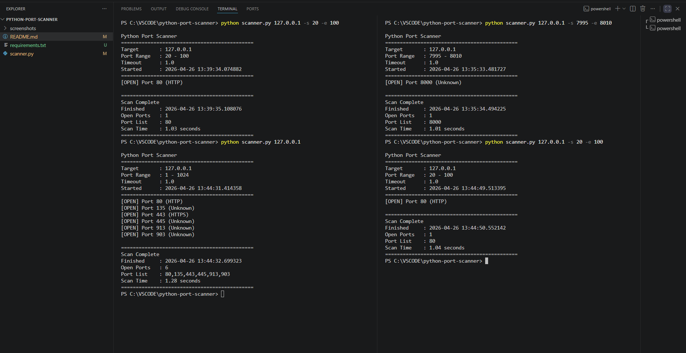
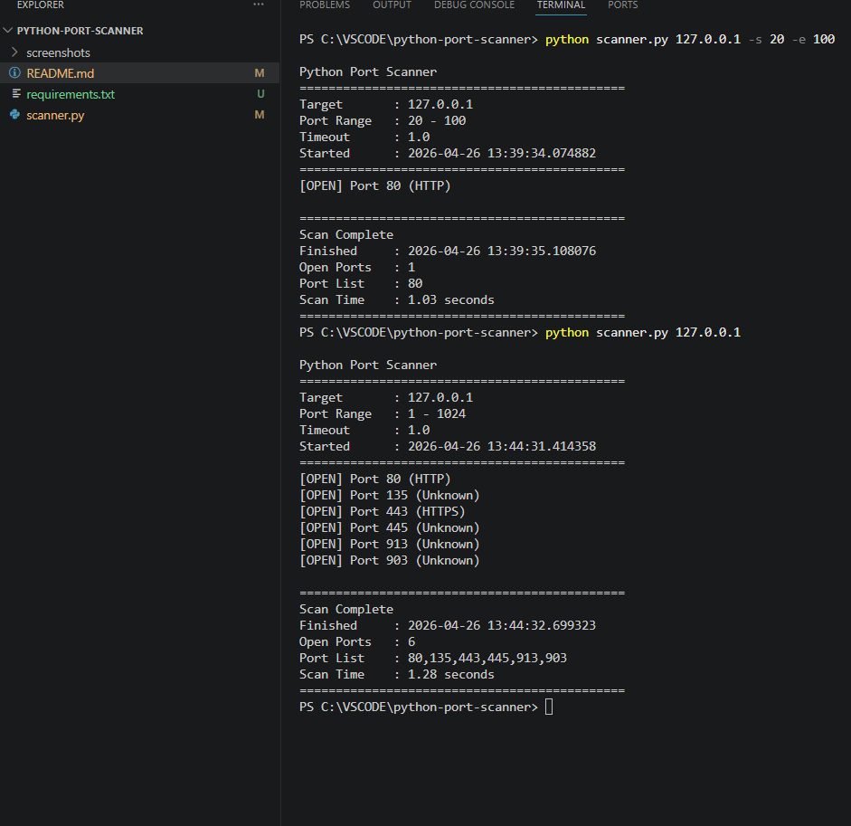

# Python Port Scanner

A Python project I built to understand how basic TCP port scanning works using sockets instead of relying only on tools like Nmap.

The goal was to learn how open ports are discovered and practice networking concepts through a small security tool.

## Why I Built This
I wanted hands-on understanding of:
- TCP connections
- Open vs closed ports
- Python socket programming
- Basic multithreading

## Features
- Scan a target IP address
- Custom port range support
- Multithreaded scanning
- Detect open ports
- Shows scan summary at the end

## Usage

Basic scan:

```bash
python scanner.py 127.0.0.1
```

Custom range:

```bash
python scanner.py 127.0.0.1 -s 1 -e 100
```

Custom timeout:

```bash
python scanner.py 127.0.0.1 -s 1 -e 100 -t 0.5
```

## Sample Output

```text
Target : 127.0.0.1
Port Range : 1-100

[OPEN] Port 22
[OPEN] Port 80

Total Open Ports: 2
```

## Screenshots





## Project Structure

```text
python-port-scanner/
├── scanner.py
├── screenshots/
├── README.md
└── requirements.txt
```

## What I Learned
This project helped me understand:
- Socket programming basics
- TCP connect scanning
- Multithreading in Python
- Basic network enumeration

## Future Improvements
Things I may add later:
- Banner grabbing
- Service detection
- Thread pool optimization
- Simple UDP scan support

## Disclaimer
Built for learning and authorized network testing only.